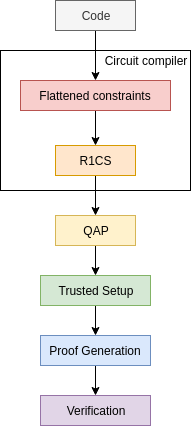
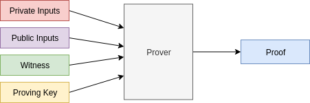
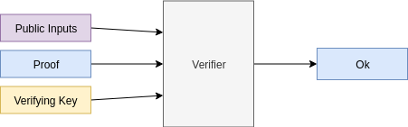
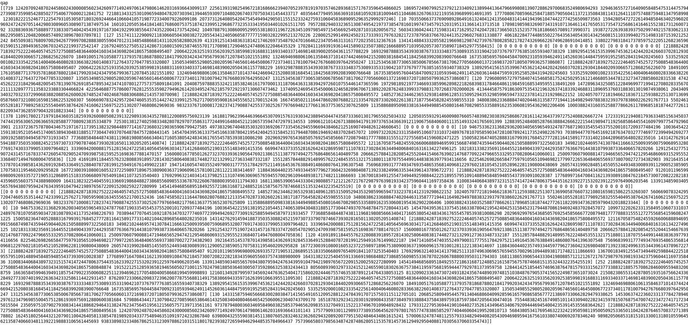

# zkSNARKs from scratch, a technical explanation

<br><br><br>
<div style="float:right; text-align:right;">
   <br>

[arnaucube.com](https://arnaucube.com)
[github.com/arnaucube](https://github.com/arnaucube)
[twitter.com/arnaucube](https://twitter.com/arnaucube)
  <br>
  <a href="https://creativecommons.org/licenses/by-nc-sa/4.0/"></a>
  2019-08-20
</div>

 <br>
[iden3.io](https://iden3.io)
[github.com/iden3](https://github.com/iden3)
[twitter.com/identhree](https://twitter.com/identhree)


---

## Warning

<div style="font-size:90%;">

- I'm not a mathematician, this talk is not for mathematicians

- In free time, have been studying zkSNARKS & implementing it in Go

- Talk about a technical explaination from an engineer point of view
- The idea is to try to transmit the learnings from long night study hours during last winter
- Also at the end will briefly overview how we use zkSNARKs in iden3
- This slides will be combined with
	- parts of the code from https://github.com/arnaucube/go-snark
	- whiteboard draws and writtings
- Don't use your own crypto. But it's fun to implement it (only for learning purposes)

</div>

---

## Contents

<div style="font-size: 90%;">

- Introduction
	- zkSNARK overview
	- zkSNARK flow
	- Generating and verifying proofs
- Foundations
	- Basics of modular arithmetic
    - Groups
	- Finite fields
	- Elliptic curve operations
- Pairings
  - Bilinear Pairings
  - BLS signatures

</div>

---

<div style="font-size: 90%;">

- zkSNARK (Pinocchio)
  - Circuit compiler
  - R1CS
  - QAP
  - Lagrange Interpolation
  - Trusted Setup
  - Proofs generation
  - Proofs verification
- Groth16
- How we use zkSNARKs in iden3
- libraries
- Circuit languages
- utilities (Elliptic curve & Hash functions) inside the zkSNARK libraries
	- BabyJubJub
	- Mimc
	- Poseidon
- References

</div>

---

## Introduction
- zero knowledge concept
- examples
- some concept explanations
	- https://en.wikipedia.org/wiki/Zero-knowledge_proof
	- https://hackernoon.com/wtf-is-zero-knowledge-proof-be5b49735f27

---


## zkSNARK overview


- protocol to prove the correctness of a computation
- useful for
	- scalability
	- privacy
	- interoperability
- examples:
	- Alice can prove to Brenna that knows $x$ such as $f(x) = y$
	- Brenna can prove to Alice that knows a certain input which $Hash$ results in a certain known value
	- Carol can proof that is a member of an organization without revealing their identity
	- etc

---

### zkSNARK flow

<div style="text-align:center;">
	
</div>

---


### Generating and verifying proofs
Generating a proof:




<br><br>

Verifying a proof:




---


## Foundations
- Modular aritmetic
- Groups
- Finite fields
- Elliptic Curve Cryptography

---

## Basics of modular arithmetic
- Modulus, `mod`, `%`
- Remainder after division of two numbers


```python
5 mod 12 = 5
14 mod 12 = 2
83 mod 10 = 3
```

```python
5 + 3 mod 6 = 8 mod 6 = 2
```


---

## Groups
- a **set** with an **operation**
	- **operation** must be *associative*
- neutral element ($identity$): adding the neutral element to any element gives the element
- inverse: $e$ + $e_{inverse}$ = $identity$
- cyclic groups
	- finite group with a generator element
	- any element must be writable by a multiple of the generator element
- abelian group
	- group with *commutative* operation

---

## Finite fields
- algebraic structure like Groups, but with **two operations**
- extended fields concept (https://en.wikipedia.org/wiki/Field_extension)

---

## Elliptic curve
- point addition

$(x_1, y_1) + (x_2, y_2) =
(\dfrac{
x_1 y_2 + x_2 y_1
}{
1 + d x_1 x_2 y_1 y_2
},
\dfrac{
y_1 y_2 - x_1 x_2
}{
1-dx_1 x_2 y_1 y_2
})$
- G1
- G2

*(whiteboard explanation)*

---

## Pairings
- 3 typical types used for SNARKS:
	- BN (Barreto Naehrig) - used in Ethereum
	- BLS (Barreto Lynn Scott) - used in ZCash & Ethereum 2.0
	- MNT (Miyaji- Nakabayashi - Takano) - used in CodaProtocol
- $y^2 = x^3 + b$ with embedding degree 12
- function that maps (pairs) two points from sets `S1` and `S2` into another set `S3`
- is a [bilinear](https://en.wikipedia.org/wiki/Bilinear_map) function
- $e(G_1, G_2) -> G_T$
- the groups must be
	- cyclic
	- same prime order ($r$)

---

- $F_q$, where $q=$`21888242871839275222246405745257275088696311157297823662689037894645226208583`
- $F_r$, where $r=$`21888242871839275222246405745257275088548364400416034343698204186575808495617`

---

## Bilinear Pairings
$e(P_1 + P_2, Q_1) ==  e(P_1, Q_1) \cdot e(P_2, Q_1)$

$e(P_1, Q_1 + Q_2) ==  e(P_1, Q_1) \cdot e(P_1, Q_2)$

$e(aP, bQ) == e(P, Q)^{ab} == e(bP, aQ)$


$e(g_1, g_2)^6 == e(g_1, 6 \cdot g_2)$

$e(g_1, g_2)^6 == e(6 \cdot g_1, g_2)$

$e(g_1, g_2)^6 == e(3 \cdot g_1, 2 g_2)$

$e(g_1, g_2)^6 == e(2 \cdot g_1, 3 g_2)$


---

### BLS signatures
*(small overview, is offtopic here, but is interesting)*
- key generation
	- random private key $x$ in $[0, r-1]$
	- public key $g^x$
- signature
	- $h=Hash(m)$ (over G2)
	- signature $\sigma=h^x$
- verification
	- check that: $e(g, \sigma) == e(g^x, Hash(m))$
	$e(g, h^x) == e(g^x, h)$


---

- aggregate signatures
	- $s = s0 + s1 + s2 ...$
- verify aggregated signatures

<div style="font-size:75%">
  
$e(G,S) == e(P, H(m))$

$e(G, s0+s1+s2...) == e(p0, H(m)) \cdot e(p1, H(m)) \cdot e(p2, H(m)) ...$

</div>


More info: https://crypto.stanford.edu/~dabo/pubs/papers/BLSmultisig.html

---

## Circuit compiler
- not a software compiler -> a constraint prover
	- what this means
- constraint concept
	- `value0` == `value1` `<operation>` `value2`
- want to proof that a certain computation has been done correctly
- graphic of circuit with gates (whiteboard)

- about high level programing languages for zkSNARKS, by *Harry Roberts*: https://www.youtube.com/watch?v=nKrBJo3E3FY

---

Circuit code example:
$f(x) = x^5 + 2\cdot x + 6$

```
func exp5(private a):
	b = a * a
	c = a * b
	d = a * c
	e = a * d
	return e

func main(private s0, public s1):
	s2 = exp5(s0)
	s3 = s0 * 2
	s4 = s3 + s2
	s5 = s4 + 6
	equals(s1, s5)
	out = 1 * 1
```

---

## Inputs and Witness
For a certain circuit, with the inputs that we calculate the Witness for the circuit signals
- private inputs: `[8]`
	- in this case the private input is the 'secret' $x$ value that computed into the equation gives the expected $f(x)$
- public inputs: `[32790]`
	- in this case the public input is the result of the equation
- signals: `[one s1 s0 b0 c0 d0 s2 s3 s4 s5 out]`
- witness: `[1 32790 8 64 512 4096 32768 16 32784 32790 1]`

---

## R1CS
- Rank 1 Constraint System
- way to write down the constraints by 3 linear combinations
- 1 constraint per operation
- $(A, B, C) = A.s \cdot B.s - C.s = 0$
- from flat code constraints we can generate the R1CS

---

## R1CS

<div style="font-size:65%">
  
$(a_{11}s_1 + a_{12}s_2 + ... + a_{1n}s_n) \cdot (b_{11}s_1 + b_{12}s_2 + ... + b_{1n}s_n) - (c_{11}s_1 + c_{12}s_2 + ... + c_{1n}s_n) = 0$

$(a_{21}s_1 + a_{22}s_2 + ... + a_{2n}s_n) \cdot (b_{21}s_1 + b_{22}s_2 + ... + b_{2n}s_n) - (c_{21}s_1 + c_{22}s_2 + ... + c_{2n}s_n) = 0$
$(a_{31}s_1 + a_{32}s_2 + ... + a_{3n}s_n) \cdot (b_{31}s_1 + b_{32}s_2 + ... + b_{3n}s_n) - (c_{31}s_1 + c_{32}s_2 + ... + c_{3n}s_n) = 0$
[...]
$(a_{m1}s_1 + a_{m2}s_2 + ... + a_{mn}s_n) \cdot (b_{m1}s_1 + b_{m2}s_2 + ... + b_{mn}s_n) - (c_{m1}s_1 + c_{m2}s_2 + ... + c_{mn}s_n) = 0$

*where $s$ are the signals of the circuit, and we need to find $a, b, c$ that satisfies the equations
</div>

---

R1CS constraint example:
- signals: `[one s1 s0 b0 c0 d0 s2 s3 s4 s5 out]`
- witness: `[1 32790 8 64 512 4096 32768 16 32784 32790 1]`
- First constraint flat code: `b0 == s0 * s0`
- R1CS first constraint:
$A_1 = [00100000000]$
$B_1 = [00100000000]$
$C_1 = [00010000000]$

---

R1CS example:

| $A$| $B$ | $C$: |
|-|-|-|
| $[0 0 1 0 0 0 0 0 0 0 0]$<br>$[0 0 1 0 0 0 0 0 0 0 0]$<br>$[0 0 1 0 0 0 0 0 0 0 0]$<br>$[0 0 1 0 0 0 0 0 0 0 0]$<br>$[0 0 1 0 0 0 0 0 0 0 0]$<br>$[0 0 0 0 0 0 1 1 0 0 0]$<br>$[6 0 0 0 0 0 0 0 1 0 0]$<br>$[0 0 0 0 0 0 0 0 0 1 0]$<br>$[0 1 0 0 0 0 0 0 0 0 0]$<br>$[1 0 0 0 0 0 0 0 0 0 0]$ | $[0 0 1 0 0 0 0 0 0 0 0]$<br>$[0 0 0 1 0 0 0 0 0 0 0]$<br>$[0 0 0 0 1 0 0 0 0 0 0]$<br>$[0 0 0 0 0 1 0 0 0 0 0]$<br>$[2 0 0 0 0 0 0 0 0 0 0]$<br>$[1 0 0 0 0 0 0 0 0 0 0]$<br>$[1 0 0 0 0 0 0 0 0 0 0]$<br>$[1 0 0 0 0 0 0 0 0 0 0]$<br>$[1 0 0 0 0 0 0 0 0 0 0]$<br>$[1 0 0 0 0 0 0 0 0 0 0]$ | $[0 0 0 1 0 0 0 0 0 0 0]$ <br>$[0 0 0 0 1 0 0 0 0 0 0]$<br>$[0 0 0 0 0 1 0 0 0 0 0]$<br>$[0 0 0 0 0 0 1 0 0 0 0]$<br>$[0 0 0 0 0 0 0 1 0 0 0]$<br>$[0 0 0 0 0 0 0 0 1 0 0]$<br>$[0 0 0 0 0 0 0 0 0 1 0]$<br>$[0 1 0 0 0 0 0 0 0 0 0]$<br>$[0 0 0 0 0 0 0 0 0 1 0]$<br>$[0 0 0 0 0 0 0 0 0 0 1]$ |


---

## QAP
- Quadratic Arithmetic Programs
- 3 polynomials, linear combinations of R1CS
- very good article about QAP by Vitalik Buterin https://medium.com/@VitalikButerin/quadratic-arithmetic-programs-from-zero-to-hero-f6d558cea649

---



---

### Lagrange Interpolation
(Polynomial Interpolation)
- for a group of points, we can find the smallest degree polynomial that goees through all that points
	- this polynomial is unique for each group of points


---

$L(x) = \sum_{j=0}^{n} y_j l_j(x)$

<br><br>


---

#### Shamir's Secret Sharing
*(small overview, is offtopic here, but is interesting)*

- from a secret to be shared, we generate 5 parts, but we can specify a number of parts that are needed to recover the secret
- so for example, we generate 5 parts, where we will need only 3 of that 5 parts to recover the secret, and the order doesn't matter
- we have the ability to define the thresholds of $M$ parts to be created, and $N$ parts to be able the recover

---

##### Shamir's Secret Sharing -  Secret generation
- we want that are necessary $n$ parts of $m$ to recover $s$
	- where $n<m$
- need to create a polynomial of degree $n-1$
$f(x) = \alpha_0 + \alpha_1 x  + \alpha_2 x^2 + \alpha_3 x^3 + ... + + \alpha_{n-1} x^{n-1}$
- where $\alpha_0$ is the secret $s$
- $\alpha_i$ are random values that build the polynomial
*where $\alpha_0$ is the secret to share, and $\alpha_i$ are the random values inside the $Finite Field$

---

$f(x) = \alpha_0 + \alpha_1 x  + \alpha_2 x^2 + \alpha_3 x^3 + ... + + \alpha_{n-1} x^{n-1}$

- the packets that we will generate are $P = (x, f(x))$
    - where $x$ is each one of the values between $1$ and $m$
        - $P_1=(1, f(1))$
        - $P_2=(2, f(2))$
        - $P_3=(3, f(3))$
        - ...
        - $P_m=(m, f(m))$

---

##### Shamir's Secret Sharing - Secret recovery
- in order to recover the secret $s$, we will need a minimum of $n$ points of the polynomial
	- the order doesn't matter
- with that $n$ parts, we do Lagrange Interpolation/Polynomial Interpolation, recovering the original polynomial

---

## QAP

<div style="font-size:50%">

$(\alpha_1(x)s_1 + \alpha_2(x)s_2 + ... + \alpha_n(x)s_n) \cdot (\beta_1(x)s_1 + \beta_2(x)s_2 + ... + \beta_n(x)s_n) - (\gamma_1(x)s_1 + \gamma_2(x)s_2 + ... + \gamma_n(x)s_n) = P(x)$

|----------------------- $A(x)$ -----------------------|------------------------ $B(x)$ -----------------------|------------------------ $C(x)$ ------------------------|

</div>

<div style="font-size:70%">

- $P(x) = A(x)B(x)-C(x)$
- $P(x) = Z(x) h(x)$
- $Z(x)$: divisor polynomial
	- $Z(x) = (x - x_1)(x-x_2)...(x-x_m) => ...=> (x_1, 0), (x_2, 0), ..., (x_m, 0)$
		- optimizations with FFT
- $h(x) = P(x) / Z(x)$

</div>

---

*The following explanation is for the [Pinocchio protocol](https://eprint.iacr.org/2013/279.pdf), all the examples will be for this protocol. The [Groth16](https://eprint.iacr.org/2016/260.pdf) is explained also in the end of this slides.*

---

## Trusted Setup
- concept
- $\tau$ (Tau)
- "Toxic waste"
- Proving Key
- Verification Key

---

$g_1 t^0, g_1 t^1, g_1 t^2, g_1 t^3, g_1 t^4, ...$
$g_2 t^0, g_2 t^1, g_2 t^2, g_2 t^3, g_2 t^4, ...$

---

Proving Key:
$pk = (C, pk_A, pk_A', pk_B, pk_B', pk_C, pk_C', pk_H)$ where:
- $pk_A = \{ A_i(\tau) \rho_A P_1 \}^{m+3}_{i=0}$
- $pk_A' = \{ A_i(\tau) \alpha_A \rho_A P_1 \}^{m+3}_{i=n+1}$
- $pk_B = \{ B_i(\tau) \rho_B P_2 \}^{m+3}_{i=0}$
- $pk_B' = \{ B_i(\tau) \alpha_B \rho_B P_1 \}^{m+3}_{i=0}$
- $pk_C = \{ C_i(\tau) \rho_C P_1 \}^{m+3}_{i=0} = \{C_i(\tau) \rho_A \rho_B P_1\}^{m+3}_{i=0}$
- $pk_C' = \{ C_i(\tau) \alpha_C \rho_C P_1 \}^{m+3}_{i=0} = \{ C_i(\tau) \alpha_C \rho_A \rho_B P_1 \}^{m+3}_{i=0}$
- $pk_K = \{ \beta (A_i(\tau) \rho_A + B_i(\tau) \rho_B C_i(\tau) \rho_A \rho_B) P_1 \} ^{m+3}_{i=0}$
- $pk_H = \{ \tau^i P_1 \}^d_{i=0}$

where:
- $d$: degree of polynomial $Z(x)$
- $m$: number of circuit signals

---

Verification Key:
$vk = (vk_A, vk_B, vk_C, vk_\gamma, vk^1_{\beta\gamma}, vk^2_{\beta\gamma}, vk_Z, vk_{IC})$
- $vk_A = \alpha_A P_2$, $vk_B = \alpha_B P_1$, $vk_C = \alpha_C P_2$
- $vk_{\beta\gamma} = \gamma P_2$, $vk^1_{\beta\gamma} = \beta\gamma P_1$, $vk^2_{\beta\gamma} = \beta\gamma P_2$
- $vk_Z = Z(\tau) \rho_A \rho_B P_2$, $vk_{IC} = (A_i(\tau) \rho_A P_1)^n_{i=0}$

---

```go
type Pk struct { // Proving Key pk:=(pkA, pkB, pkC, pkH)
        G1T [][3]*big.Int // t encrypted in G1 curve, G1T == Pk.H
        A   [][3]*big.Int
        B   [][3][2]*big.Int
        C   [][3]*big.Int
        Kp  [][3]*big.Int
        Ap  [][3]*big.Int
        Bp  [][3]*big.Int
        Cp  [][3]*big.Int
        Z   []*big.Int
}

type Vk struct {
        Vka   [3][2]*big.Int
        Vkb   [3]*big.Int
        Vkc   [3][2]*big.Int
        IC    [][3]*big.Int
        G1Kbg [3]*big.Int    // g1 * Kbeta * Kgamma
        G2Kbg [3][2]*big.Int // g2 * Kbeta * Kgamma
        G2Kg  [3][2]*big.Int // g2 * Kgamma
        Vkz   [3][2]*big.Int
}
```

---

```go
// Setup is the data structure holding the Trusted Setup data. The Setup.Toxic sub struct must be destroyed after the GenerateTrustedSetup function is completed
type Setup struct {
        Toxic struct {
                T      *big.Int // trusted setup secret
                Ka     *big.Int
                Kb     *big.Int
                Kc     *big.Int
                Kbeta  *big.Int
                Kgamma *big.Int
                RhoA   *big.Int
                RhoB   *big.Int
                RhoC   *big.Int
        }
        Pk Pk
        Vk Vk
}
```

---

## Proofs generation
- $A, B, C, Z$ (from the QAP)
- random $\delta_1, \delta_2, \delta_3$
- $H(z)= \dfrac{A(z)B(z)-C(z)}{Z(z)}$
	- $A(z) = A_0(z) + \sum_{i=1}^m s_i A_i(x) + \delta_1 Z(z)$
	- $B(z) = B_0(z) + \sum_{i=1}^m s_i B_i(x) + \delta_2 Z(z)$
	- $C(z) = C_0(z) + \sum_{i=1}^m s_i B_i(x) + \delta_2 Z(z)$
(where $m$ is the number of public inputs)

---

- $\pi_A = <c, pk_A>$
- $\pi_A' = <c, pk_A'>$
- $\pi_B = <c, pk_B>$
	- example:
	```go
    for i := 0; i < circuit.NVars; i++ {
    	proof.PiB = Utils.Bn.G2.Add(proof.PiB, Utils.Bn.G2.MulScalar(pk.B[i], w[i]))
		proof.PiBp = Utils.Bn.G1.Add(proof.PiBp, Utils.Bn.G1.MulScalar(pk.Bp[i], w[i]))
    }
	```
($c=1+witness+\delta_1+\delta_2+\delta_3$
- $\pi_B' = <c, pk_B'>$
- $\pi_C = <c, pk_C>$
- $\pi_C' = <c, pk_C'>$
- $\pi_K = <c, pk_K>$
- $\pi_H = <h, pk_KH>$
- proof: $\pi = (\pi_A, \pi_A', \pi_B, \pi_B', \pi_C, \pi_C', \pi_K, \pi_H$

---

## Proofs verification


- $vk_{kx} = vk_{IC,0} + \sum_{i=1}^n x_i vk_{IC,i}$

Verification:
- $e(\pi_A, vk_a) == e(\pi_{A'}, g_2)$
- $e(vk_b, \pi_B) == e(\pi_{B'}, g_2)$
- $e(\pi_C, vk_c) == e(\pi_{C'}, g_2)$
- $e(vk_{kx}+\pi_A, \pi_B) == e(\pi_H, vk_{kz}) \cdot e(\pi_C, g_2)$
- $e(vk_{kx} + \pi_A + \pi_C, V_{\beta\gamma}^2) \cdot e(vk_{\beta\gamma}^1, \pi_B) == e(\pi_k, vk_{\gamma}^1)$

---


<div style="font-size:60%">
Example (whiteboard):
<br><br>

$\dfrac{
	e(\pi_A, \pi_B)
}{
	e(\pi_C, g_2)
}
= e(g_1 h(t), g_2 z(t))
$
<br>
$\dfrac{
	e(A_1 + A_2 + ... + A_n, B_1 + B_2 + ... + B_n)
}{
	e(C_1 + C_2 + ... + C_n, g_2)
}
= e(g_1 h(t), g_2 z(t))
$
<br>
$\dfrac{
	e(g_1 \alpha_1(t) s_1 + g_1 \alpha_2(t) s_2 + ... + g_1 \alpha_n(t) s_n, g_2 \beta_1(t)s_1 + g_2 \beta_2(t) s_2 + ... + g_2 \beta_n(t) s_n)
}{
	e(g_1 \gamma_1(t) s_1 + g_1 \gamma_2(t) s_2 + ... + g_1 \gamma_n(t) s_n, g_2)
}
= e(g_1 h(t), g_2 z(t))
$
<br>
$
e(g_1 \alpha_1(t) s_1 + g_1 \alpha_2(t) s_2 + ... + g_1 \alpha_n(t) s_n, g_2 \beta_1(t)s_1 + g_2 \beta_2(t) s_2 + ... + g_2 \beta_n(t) s_n)$
$= e(g_1 h(t), g_2 z(t)) \cdot e(g_1 \gamma_1(t) s_1 + g_1 \gamma_2(t) s_2 + ... + g_1 \gamma_n(t) s_n, g_2)
$

</div>


---

## Groth16


### Trusted Setup
$\tau = \alpha, \beta, \gamma, \delta, x$

$\sigma_1 =$
- $\alpha, \beta, \delta, \{ x^i\}_{i=0}^{n-1}$

- $\{
\dfrac{
\beta u_i(x) + \alpha v_i(x) + w_i(x)
}{
\gamma
}
\}_{i=0}^l$

- $\{
\dfrac{
\beta u_i(x) + \alpha v_i(x) + w_i(x)
}{
\delta
}
\}_{i=l+1}^m$

- $\{
\dfrac{x^i t(x)}{\delta}
\}_{i=0}^{n-2}$

$\sigma_2 = (\beta, \gamma, \delta, \{ x^i \}_{i=0}^{n-1})$

*(where $u_i(x), v_i(x), w_i(x)$ are the $QAP$)*

---

```go
type Pk struct { // Proving Key
	BACDelta [][3]*big.Int // {( βui(x)+αvi(x)+wi(x) ) / δ } from l+1 to m
	Z        []*big.Int
	G1       struct {
		Alpha    [3]*big.Int
		Beta     [3]*big.Int
		Delta    [3]*big.Int
		At       [][3]*big.Int // {a(τ)} from 0 to m
		BACGamma [][3]*big.Int // {( βui(x)+αvi(x)+wi(x) ) / γ } from 0 to m
	}
	G2 struct {
		Beta     [3][2]*big.Int
		Gamma    [3][2]*big.Int
		Delta    [3][2]*big.Int
		BACGamma [][3][2]*big.Int // {( βui(x)+αvi(x)+wi(x) ) / γ } from 0 to m
	}
	PowersTauDelta [][3]*big.Int // powers of τ encrypted in G1 curve, divided by δ
}
```

---

```go
type Vk struct {
	IC [][3]*big.Int
	G1 struct {
		Alpha [3]*big.Int
	}
	G2 struct {
		Beta  [3][2]*big.Int
		Gamma [3][2]*big.Int
		Delta [3][2]*big.Int
	}
}
```


---

```go
// Setup is the data structure holding the Trusted Setup data. The Setup.Toxic sub struct must be destroyed after the GenerateTrustedSetup function is completed
type Setup struct {
	Toxic struct {
		T      *big.Int // trusted setup secret
		Kalpha *big.Int
		Kbeta  *big.Int
		Kgamma *big.Int
		Kdelta *big.Int
	}
	Pk Pk
	Vk Vk
}
```

---

#
## Proofs Generation
$\pi_A=\alpha + \sum_{i=0}^m \alpha_i u_i(x) + r \delta$
$\pi_B=\beta + \sum_{i=0}^m \alpha_i v_i(x) + s \delta$

<div style="font-size:80%;">

$\pi_C = \dfrac{
\sum_{i=l+1}^m a_i(\beta u_i(x) + \alpha v_i(x) + w_i(x)) + h(x)t(x)
}{
\delta
} + \pi_As + \pi_Br -rs\delta$

</div>

$\pi=\pi_A^1, \pi_B^1, \pi_C^2$

---

### Proof Verification

<div style="font-size:75%;">
  
$[\pi_A]_1 \cdot [\pi_B]_2 = [\alpha]_1 \cdot [\beta]_2 +
\sum_{i=0}^l a_i [
\dfrac{
\beta u_i(x) + \alpha v_i(x) + w_i(x)
}{
\gamma
}
]_1
\cdot [\gamma]_2 + [\pi_C]_1 \cdot [\delta]_2
$
  
</div>

$e(\pi_A, \pi_B) = e(\alpha, \beta) \cdot e(pub, \gamma) \cdot e(\pi_C, \delta)$


---

## How we use zkSNARKs in iden3
- proving a credentials without revealing it's content
- proving that an identity has a claim issued by another identity, without revealing all the data
- proving any property of an identity
- $ITF$ (Identity Transition Function), a way to prove with a zkSNARK that an identity has been updated following the defined protocol
	- identities can not cheat when issuing claims
- etc

## Other ideas for free time side project
- Zendermint (Tendermint + zkSNARKs)

---


## zkSNARK libraries
- [bellman](https://github.com/zkcrypto/bellman) (rust)
- [libsnark](https://github.com/scipr-lab/libsnark) (c++)
- [snarkjs](https://github.com/iden3/snarkjs) (javascript)
- [websnark](https://github.com/iden3/websnark) (wasm)
- [go-snark](https://github.com/arnaucube/go-snark) (golang) <span style="font-size:80%;">[do not use in production]<span>

## Circuit languages
| language | snark library with which plugs in |
|-----|-----|
| [Zokrates](https://github.com/Zokrates/ZoKrates) | libsnark, bellman |
| [Snarky](https://github.com/o1-labs/snarky) | libsnark |
| [circom](https://github.com/iden3/circom) | snarkjs, websnark, bellman |
| [go-snark-circuit](https://github.com/arnaucube/go-snark) | go-snark |

---

## Utilities (Elliptic curve & Hash functions) inside the zkSNARK
- we work over $F_r$, where $r=$`21888242871839275222246405745257275088548364400416034343698204186575808495617`

- BabyJubJub
- Mimc
- Poseidon

---

##### *Utilities (Elliptic curve & Hash functions) inside the zkSNARK*

### BabyJubJub
- explaination: https://medium.com/zokrates/efficient-ecc-in-zksnarks-using-zokrates-bd9ae37b8186
- implementations:
	- go: https://github.com/iden3/go-iden3-crypto
	- javascript & circom: https://github.com/iden3/circomlib
	- rust: https://github.com/arnaucube/babyjubjub-rs
	- c++: https://github.com/barryWhiteHat/baby_jubjub_ecc

---

##### *Utilities (Elliptic curve & Hash functions) inside the zkSNARK*

### Mimc7
- explaination: https://eprint.iacr.org/2016/492.pdf
- implementations in:
	- go: https://github.com/iden3/go-iden3-crypto
	- javascript & circom: https://github.com/iden3/circomlib
	- rust: https://github.com/arnaucube/mimc-rs

---

##### *Utilities (Elliptic curve & Hash functions) inside the zkSNARK*

### Poseidon
- explaination: https://eprint.iacr.org/2019/458.pdf
- implementations in:
	- go: https://github.com/iden3/go-iden3-crypto
	- javascript & circom: https://github.com/iden3/circomlib

---

# References
- `Succinct Non-Interactive Zero Knowledge for a von Neumann Architecture`, Eli Ben-Sasson, Alessandro Chiesa, Eran Tromer, Madars Virza https://eprint.iacr.org/2013/879.pdf
- `Pinocchio: Nearly practical verifiable computation`, Bryan Parno, Craig Gentry, Jon Howell, Mariana Raykova https://eprint.iacr.org/2013/279.pdf
- `On the Size of Pairing-based Non-interactive Arguments`, Jens Groth https://eprint.iacr.org/2016/260.pdf
- (also all the links through the slides)

---

<div style="text-align:center;">
Thank you very much
<br>

</div>


<div style="float:right; text-align:right;">
   <br>

[arnaucube.com](https://arnaucube.com)
[github.com/arnaucube](https://github.com/arnaucube)
[twitter.com/arnaucube](https://twitter.com/arnaucube)
  
  <a href="https://creativecommons.org/licenses/by-nc-sa/4.0/"></a>
  2019-08-20
</div>

 <br>
[iden3.io](https://iden3.io)
[github.com/iden3](https://github.com/iden3)
[twitter.com/identhree](https://twitter.com/identhree)
